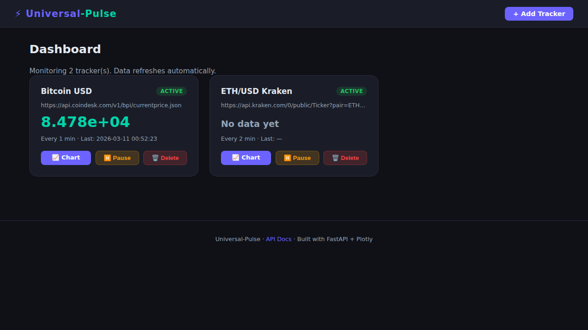
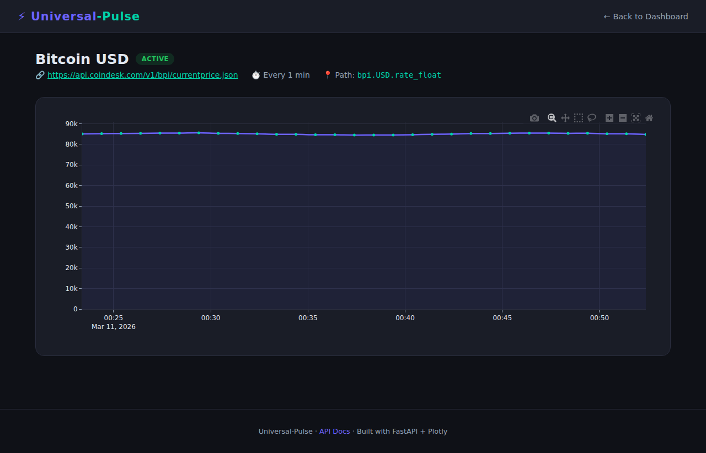
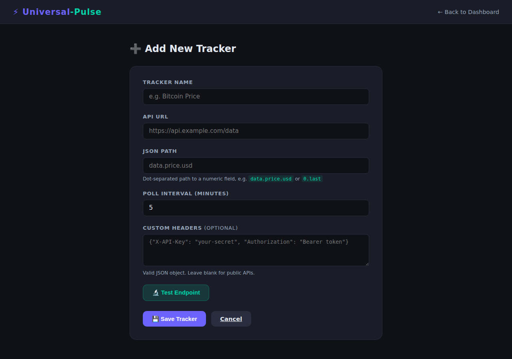

# ⚡ Universal-Pulse

> **A self-hosted, multi-API data monitor that runs on your Raspberry Pi (or any Docker host).**
> Track any JSON API over time and visualise it with beautiful dark-mode charts — no cloud required.

---

## ✨ Features

| Feature | Details |
|---|---|
| **Dynamic Trackers** | Add any HTTP JSON API, set a dot-path (e.g. `data.price.usd`) and a poll interval |
| **Interactive Charts** | Dark-mode Plotly line charts with hover tooltips, zoom, and pan |
| **Test Button** | Validate your API URL + JSON path instantly before saving |
| **Custom Auth Headers** | Pass `X-API-Key`, `Authorization: Bearer`, or any header to private APIs |
| **Basic Auth UI** | Protect the whole dashboard with `AUTH_USER` / `AUTH_PASSWORD` env vars |
| **Pause / Resume** | Toggle individual trackers without losing historical data |
| **Raspberry Pi Ready** | Multi-arch Docker image (`linux/amd64` + `linux/arm64`) |
| **Zero dependencies** | Single container, SQLite database, no external services needed |

---

## 🖥 Screenshots

### Dashboard


> The main dashboard shows all active trackers, their latest values, poll interval, and last seen timestamps. Each card links to the detailed chart view.

### Chart Detail


> Interactive Plotly chart showing a tracker's value history. Supports zoom, pan, and hover tooltips.

### Add Tracker Form


> The "Add Tracker" form with the live Test Endpoint button. Paste your API URL and JSON path, hit Test, and see the extracted value before saving.

---

## 🚀 Quick Start

### Docker Compose (recommended)

```bash
# 1. Clone the repository
git clone https://github.com/nicolasasauer/universal-pulse.git
cd universal-pulse

# 2. (Optional) Set Basic-Auth
cp .env.example .env
# Edit .env and set AUTH_USER and AUTH_PASSWORD

# 3. Start the container
docker compose up -d

# 4. Open the dashboard
open http://localhost:8000
```

### Direct Docker run

```bash
docker run -d \
  --name universal-pulse \
  --restart unless-stopped \
  -p 8000:8000 \
  -v pulse-data:/data \
  -e AUTH_USER=admin \
  -e AUTH_PASSWORD=secret \
  ghcr.io/nicolasasauer/universal-pulse:latest
```

### On a Raspberry Pi

The image is built for `linux/arm64` — no emulation needed on Pi 4/5:

```bash
# On the Pi (Raspberry Pi OS 64-bit or Ubuntu 22.04 arm64):
docker compose up -d
```

---

## ⚙️ Configuration

All configuration is done via **environment variables**:

| Variable | Default | Description |
|---|---|---|
| `AUTH_USER` | *(empty)* | Basic-Auth username. Leave blank to disable auth. |
| `AUTH_PASSWORD` | *(empty)* | Basic-Auth password. |
| `DATA_DIR` | `/data` | Directory where `pulse.db` is stored. |
| `LOG_LEVEL` | `INFO` | Python logging level (`DEBUG`, `INFO`, `WARNING`, `ERROR`). |

---

## 📡 REST API

The full OpenAPI documentation is available at **`http://localhost:8000/docs`**.

| Method | Endpoint | Description |
|---|---|---|
| `GET` | `/api/trackers` | List all trackers |
| `POST` | `/api/trackers` | Create a tracker |
| `DELETE` | `/api/trackers/{id}` | Delete a tracker |
| `GET` | `/api/trackers/{id}/readings` | Get readings for a tracker |
| `POST` | `/api/test` | Test an API URL + JSON path |

**Example — create a tracker via curl:**

```bash
curl -X POST http://localhost:8000/api/trackers \
  -H "Content-Type: application/json" \
  -d '{
    "name": "Bitcoin USD",
    "url": "https://api.coindesk.com/v1/bpi/currentprice.json",
    "json_path": "bpi.USD.rate_float",
    "interval": 1
  }'
```

---

## 🏗 Project Structure

```
universal-pulse/
├── app/
│   ├── main.py          # FastAPI application, UI routes, REST API
│   ├── database.py      # SQLAlchemy models (Tracker, Reading) + CRUD helpers
│   ├── collector.py     # APScheduler background worker
│   └── templates/       # Jinja2 HTML templates (dark-mode UI)
│       ├── dashboard.html
│       ├── detail.html
│       └── add_tracker.html
├── Dockerfile           # Multi-stage, multi-arch build
├── docker-compose.yml
├── requirements.txt
└── .github/
    └── workflows/
        └── docker-publish.yml  # CI/CD: build + push to GHCR
```

---

## 🔧 Local Development

```bash
# Create a virtual environment
python -m venv .venv
source .venv/bin/activate

# Install dependencies
pip install -r requirements.txt

# Run the app (creates ./data/pulse.db locally)
DATA_DIR=./data uvicorn app.main:app --reload --port 8000
```

---

## 🐳 CI/CD

Every push to `main` and every `v*.*.*` tag triggers the GitHub Actions workflow
(`.github/workflows/docker-publish.yml`) which:

1. Builds the image for `linux/amd64` **and** `linux/arm64` using Docker Buildx + QEMU
2. Pushes to `ghcr.io/nicolasasauer/universal-pulse`
3. Attaches a signed SLSA provenance attestation

---

## 📦 Tech Stack

- **[FastAPI](https://fastapi.tiangolo.com/)** — async Python web framework
- **[APScheduler](https://apscheduler.readthedocs.io/)** — background job scheduler
- **[SQLAlchemy 2](https://www.sqlalchemy.org/)** — ORM + SQLite
- **[httpx](https://www.python-httpx.org/)** — modern HTTP client
- **[Plotly.js](https://plotly.com/javascript/)** — interactive charts
- **[Jinja2](https://jinja.palletsprojects.com/)** — server-side HTML templating
- **[Docker Buildx](https://docs.docker.com/buildx/)** — multi-platform builds

---

## ⚠️ Vibecoded Disclaimer

> This project was built with the help of AI-assisted development. The code works, but may not follow all conventional best practices. Use at your own risk – contributions and improvements are always welcome!

---

## 📄 License

MIT — see [LICENSE](LICENSE).
